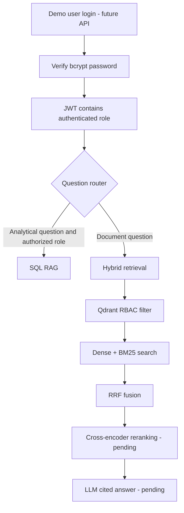

# MediBot

MediBot is a learning project for role-based Retrieval-Augmented Generation (RAG) in a healthcare setting. It combines a local SQLite database, Docling document ingestion, Qdrant hybrid retrieval, and role-based access control.

The project is being built in learning stages. The implemented commands below work from the terminal; the FastAPI and Next.js layers are intentionally still pending.

## Current implementation status

| Area | Status |
| --- | --- |
| Read-only SQLite data access | Implemented |
| SQL RAG: LLM SQL generation, validation, execution, natural-language answer | Implemented |
| Keyword router: SQL RAG versus Hybrid RAG | Implemented |
| Docling hierarchical chunking and Qdrant ingestion | Implemented |
| Dense + BM25 hybrid retrieval with Qdrant RBAC filter and RRF fusion | Implemented |
| Demo-user bootstrap, bcrypt password hashes, JWT session-token foundation | Implemented |
| Cross-encoder reranking | Pending |
| FastAPI endpoints (`/login`, `/chat`, `/collections/{role}`, `/health`) | Pending |
| Next.js frontend | Pending |

## Architecture



## Prerequisites

- Python 3.14 or a compatible Python version
- Docker Desktop with the legacy `docker-compose` command available
- A Groq API key for the SQL-RAG LLM calls
- The assignment source documents available locally

## Project layout

```text
MediBot/
├── backend/
│   ├── app/                 # Application, services, repositories, and core security code
│   ├── data/                # Provided SQLite data and local authentication database
│   ├── scripts/             # Explicit ingestion, retrieval, and demo-user commands
│   └── tests/               # Standard-library unittest coverage
├── data/qdrant_storage/     # Persistent local Qdrant volume; ignored by Git
├── docs/                    # Learning notes
└── docker-compose.yml       # Local Qdrant service
```

## 1. Install Python dependencies

Run these commands from the repository root:

```bash
cd backend
python3 -m venv .venv
.venv/bin/python -m pip install -r requirements.txt
```

## 2. Configure environment variables

Create `backend/.env`. This file is ignored by Git.

```ini
# Select the LLM provider and its SQL-RAG models.
REQUIRED_LLM_MODEL_GROUP=GROQ
GROQ_API_KEY=<your-groq-api-key>
GROQ_SQL_TEST_MODEL=<your-groq-test-model>
GROQ_SQL_MODEL=<your-groq-sql-model>
GROQ_ANSWER_MODEL=<your-groq-answer-model>

# Local Qdrant index settings.
QDRANT_URL=http://localhost:6333
QDRANT_COLLECTION=medibot_documents_v1
INDEX_VERSION=v1

# Authentication/session settings. JWT_SECRET_KEY must be at least 32 bytes.
JWT_SECRET_KEY=<a-private-random-value-of-at-least-32-bytes>
MEDIBOT_DEMO_PASSWORD=<your-chosen-demo-password>

# Hybrid retrieval guardrails.
HYBRID_RAG_DEFAULT_LIMIT=5
HYBRID_RAG_MAX_LIMIT=20
```

Do not commit `.env`, API keys, JWT secrets, passwords, or session tokens.

## 3. Start Qdrant

From the repository root:

```bash
docker-compose up -d qdrant
docker-compose ps
```

Qdrant is available at:

- API: `http://localhost:6333`
- Dashboard: `http://localhost:6333/dashboard`

The Docker Compose file mounts `data/qdrant_storage/` into the container so indexed vectors persist across container restarts.

## 4. Ingest assignment documents

The assignment documents are expected in the sibling path shown below. If your documents are elsewhere, replace `--source-root` with their absolute path.

```bash
cd backend

.venv/bin/python -m scripts.ingest_documents \
  --source-root ../../doc/Medibot_Assignment_Resources/mediassist_data
```

The command performs incremental ingestion:

- Parses PDF and Markdown documents with Docling.
- Uses hierarchical chunking with section context.
- Creates dense and sparse vectors through LangChain/FastEmbed.
- Stores chunks in Qdrant with collection and `access_roles` metadata.
- Skips documents whose hash, index version, and expected chunk count are unchanged.

Use `--force-reindex` only when you intentionally want to replace all discovered document chunks.

## 5. Bootstrap demo users

This command creates a separate local SQLite database at `backend/data/medibot_auth.db`. It creates the five fixed demo users once and stores bcrypt password hashes, not plaintext passwords.

```bash
cd backend
.venv/bin/python -m scripts.bootstrap_demo_users
```

| Username | Role |
| --- | --- |
| `dr.mehta` | `doctor` |
| `nurse.priya` | `nurse` |
| `billing.ravi` | `billing_executive` |
| `tech.anand` | `technician` |
| `admin.sys` | `admin` |

The command is idempotent: later runs preserve existing users rather than duplicating them. Run it as an installation step, not automatically on every backend startup.

Test a login without displaying the token:

```bash
.venv/bin/python -m scripts.login_demo_user --username nurse.priya
```

The future `/login` API will return the signed JWT to the frontend. The JWT role, not a client-supplied role, will be used by future protected endpoints.

## 6. Test Hybrid RAG retrieval

This command performs dense semantic search and sparse BM25 keyword search in Qdrant. Qdrant applies the role filter before candidates are returned, then combines the two rankings with Reciprocal Rank Fusion (RRF).

```bash
cd backend

.venv/bin/python -m scripts.query_hybrid_rag \
  "What is the MRSA isolation procedure?" \
  --role nurse \
  --limit 3
```

The `--role` argument is a terminal learning aid. In the future `/chat` API, the role will come only from a verified JWT.

## 7. Test SQL RAG

SQL RAG is limited to `billing_executive` and `admin`. It accepts only validated `SELECT` queries against `claims` and `maintenance_tickets`.

```bash
cd backend

.venv/bin/python -m app.cli \
  "How many billing claims were approved?" \
  --role billing_executive \
  --show-details
```

This command invokes the configured LLM provider. It requires a valid API key and sends the generated SQL result to the provider for a natural-language answer.

## 8. Run tests

Run tests from `backend/` so Python can resolve the `app` package:

```bash
cd backend
.venv/bin/python -m unittest discover -s tests -v
```

## RBAC model

| Role | Accessible document collections |
| --- | --- |
| `doctor` | `general`, `clinical`, `nursing` |
| `nurse` | `general`, `nursing` |
| `billing_executive` | `general`, `billing` |
| `technician` | `general`, `equipment` |
| `admin` | All collections |

The access rule is stored with each Qdrant chunk as `metadata.access_roles`. Hybrid retrieval passes the role filter to Qdrant for both dense and sparse candidate searches, so unauthorized chunks are not returned to the application.

## Learning notes

- [Qdrant concepts](docs/qdrant-learning-notes.md)
- [Document ingestion concepts](docs/ingestion-learning-notes.md)

## Security notes

- `backend/data/mediassist.db` is the provided assignment database.
- `backend/data/medibot_auth.db` is local runtime data and is ignored by Git.
- Passwords are stored only as bcrypt hashes.
- JWT signing secrets remain in `.env`; never expose them to the frontend.
- Session tokens are temporary credentials and must not be logged.
- The current terminal commands are learning tools. Authentication enforcement at HTTP boundaries will be added with FastAPI.
